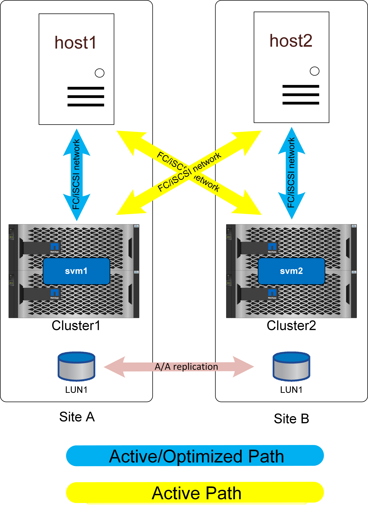

An important feature of SM-as is the ability to configure the storage systems to know where the hosts are located. When you map the LUNs to a given host, you can indicate whether or not they are proximal to a given storage system.

== Proximity settings

Proximity refers to a per-cluster configuration that indicates a particular host WWN or iSCSI initiator ID belongs to a local host. It is a second, optional step for configuring LUN access.

The first step is the usual igroup configuration. Each LUN must be mapped to an igroup that contains the WWN/iSCSi IDs of the hosts that need access to that LUN. This controls which host has _access_ to a LUN. 

The second, optional step is to configure host proximity. This does not control access, it controls _priority_. 

For example, a host at site A might be configured to access a LUN that is protected by SnapMirror active sync, and since the SAN is extended across sites, paths are available to that LUN using storage on site A or storage on site B.

Without proximity settings, that host will use both storage systems equally because both storage systems will advertise active/optimized paths. If the SAN latency and/or bandwidth between sites is limited, this may not be desireable, and you may wish to ensure that during normal operation each host preferentially uses paths to the local storage system. This is configured by adding the host WWN/iSCSI ID to the local cluster as a proximal host. This can be done at the CLI or SystemManager.

== AFF

With an AFF system, the paths would appear as shown below when host proximity has been configured.

In normal operation, all IO is local IO. Reads and writes are serviced from the local storage array. Write IO will, of course, also need to be replicated by the local controller to the remote system before being acknowledged, but all read IO will be serviced locally and will not incur extra latency by traversing the SAN link between sites.

The only time the nonoptimized paths will be used is when all active/optimized paths are lost. For example, if the entire array on site A lost power, the hosts at site A would still be able to access paths to the array on site B and therefore remain operational, although they would be experiencing higher latency. 

[Note]
There are redundant paths through the local cluster that are not shown on these diagrams for the sake of simplicity. ONTAP storage systems are HA themselves, so a controller failure should not result in site failure. It should merely result in a change in which local paths are used on the affected site.

== ASA

NetApp ASA systems offer active-active multipathing across all paths on a cluster. This also applies to SM-as configurations.

image:../media/smas-uniform-asa.png[SnapMirror active sync ASA uniform networking]

An ASA configuration with non-uniform access would work largely the same as it would with AFF. With uniform access, IO would be crossing the WAN. This may or may not be desirable. 

If the two sites were 100 meters apart with fiber connectivity there should be no detectable additional latency crossing the WAN, but if the sites were a long distance apart then read performance would suffer on both sites. In contrast, with AFF those WAN-crossing paths would only be used if there were no local paths available and day-to-day performance would be better because all IO would be local IO. ASA with nonuniform access network would be an option to gain the cost and feature benefits of ASA without incurring a cross-site latency access penalty.

ASA with SM-as in a low-latency configuration offers two interesting benefits. First, it essentially *doubles* the performance for any single host because IO can be serviced by twice as many controllers using twice as many paths. Second, in a single-site environment it offers extreme availability because an entire storage system could be lost without interrupting host access.