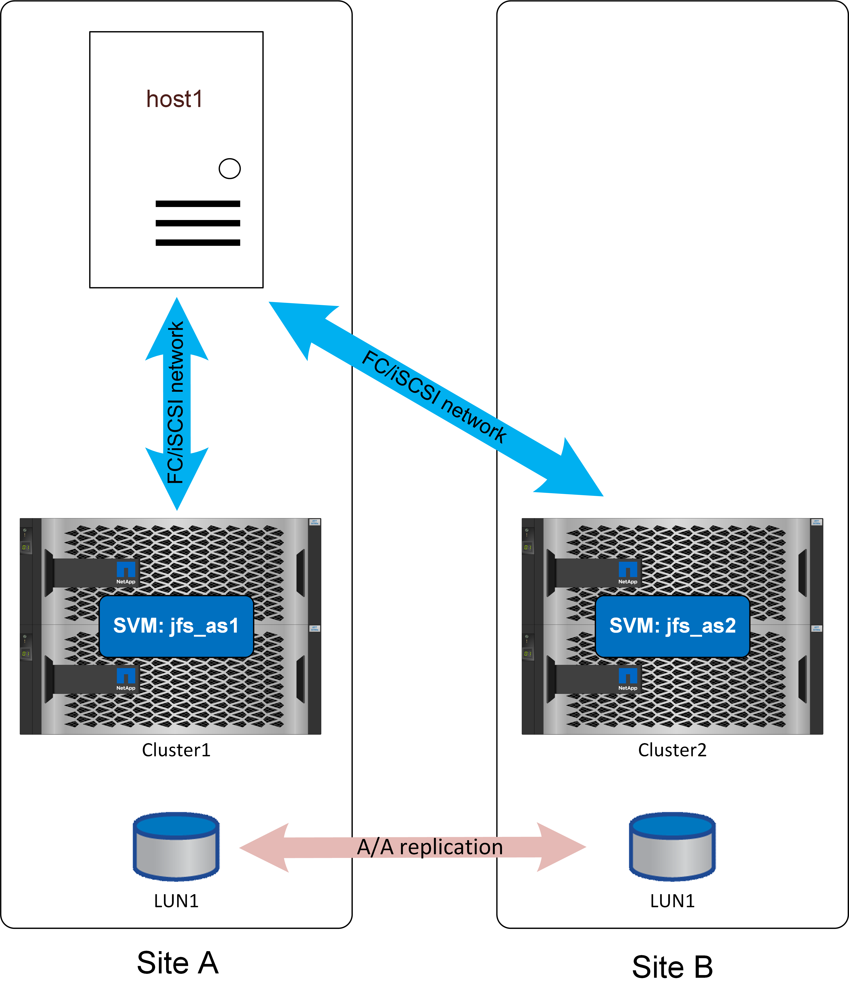

= Overview
:hardbreaks:
:icons: font
:linkattrs:
:imagesdir: ../media/

[.lead]
SQL Server can be configured to work with SnapMirror active sync in several ways. The right answer depends on the available network connectivity, RPO requirements, and availability requirements.

== Standalone instance of SQL Server

The best practices for file layout and server configuration are the same as recommended in link:mssql-storage-considerations.html[SQL Server on ONTAP] documentation. 

With a standalone setup, SQL Server could be running only at one site. Presumably link:mssql-dr-smas-uniform.html[uniform] access would be used. 

With uniform access, a storage failure at either site would not interrupt database operations. A complete site failure on the site that included the database server would, of course, result in an outage. 

Some customers could configure an OS running at the remote site with a preconfigured SQL Server setup, updated with an equivalent build version as that of the production instance. Failover would require activating that standalone instance of SQL Server at the alternate site, discovering the LUNS, and and starting the database. The complete process can be automated with the Windows Powershell cmdlet as no operations are required from the storage side.

link:mssql-dr-smas-nonuniform.html[Nonuniform] access could also be used, but the result would be a database outage if the storage system where the database server was located had failed because the database would have no available paths to storage. This still may be acceptable in some cases. SnapMirror active sync would still be providing RPO=0 data protection, and, in the event of site failure, the surviving copy would be active and ready to resume operations using the same procedure used with uniform access as described above.

A simple and automated failover process can be more more easily configured with the use of a virtualize host. For example, if SQL Server data files are synchronously replicated to secondary storage along with a boot VMDK, then, in the event of a disaster, the complete environment could be activated at the alternate site. An administrator could either manually activate the host at the surviving site, or automate the process through a service such as VMware HA. 

== SQL Server failover cluster instance

SQL Server failover instances could be also hosted on a Windows failover cluster running on a physical server or virtual server as the guest operating system. This multi-host architecture provides SQL Server instance and storage resiliency. Such deployment is helpful in high-demand environments seeking robust failover processes while maintaining enhanced performance. In a failover cluster setup, when a host or primary storage is affected then SQL Services will be failover to the secondary host, and at the same time, secondary storage will be available to serve IO. No automation script or administrator intervention is required.  
